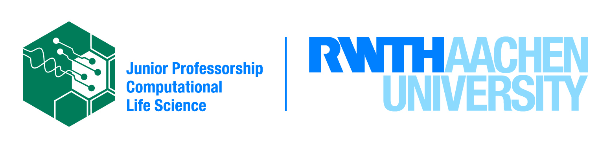

---
hide:
    - navigation
    - toc
---

Github group of the computational photobiology lab at RWTH Aachen led by Prof. Dr. Anna Matuszyńska.

You can us at the [RWTH website](https://www.cpbl.rwth-aachen.de/) and our [github page](https://www.github.com/Computational-Biology-Aachen).

# Software packages

-   :fontawesome-brands-python:{ .lg .middle } **MxlPy**

    ---

    Build and analyse **mechanistic learning** models in minutes

    [:octicons-arrow-right-24: Getting started](https://github.com/Computational-Biology-Aachen/MxlPy)

-   :fontawesome-brands-python:{ .lg } :fontawesome-brands-html5:{ .lg } **absorpig**

    ---

    Extract pigment composition from absorption spectra of photosynthetic organisms

    [:octicons-arrow-right-24: Getting started](https://github.com/Computational-Biology-Aachen/absorpig)

-   :fontawesome-brands-html5:{ .lg } **Photosynthesis in silico**

    ---

    An interactive dashboard to study photosynthesis using computational models.

    [:octicons-arrow-right-24: Start learning](https://github.com/AnnaMatuszynska/biotool-photosynthesis)

# Projects and publications

-   :fontawesome-brands-python:{ .lg } mathematical model of synechocystis sp. PCC 6803

    Some very nice descripton of this work

    [:octicons-arrow-right-24: Getting started](https://github.com/Computational-Biology-Aachen/synechocystis-photosynthesis-2024)

-   :fontawesome-brands-python:{ .lg } mRNA turnover kinetics

    Some very nice descripton of this work

    [:octicons-arrow-right-24: Getting started](https://github.com/AnnaMatuszynska/mRNAturnoverkinetics)

# Hackathons

-   :fontawesome-brands-python:{ .lg } Embu Hackathon 2023

    Material for the 2023 Hackathon Workshop on Computational Modeling to Unleash the Computational Power of Young African Researchers in Embu, Kenya.

    [:octicons-arrow-right-24: Getting started](https://github.com/Computational-Biology-Aachen/HackathonEmbu2023)

# Lab members

- [Prof. Dr. Anna Matuszyńska](https://github.com/AnnaMatuszynska) 
- Dr. Tim Nies 
- [Dr. Marvin van Aalst](https://github.com/marvinvanaalst) 
- [Tobias Pfennig](https://github.com/pfennigt) 
- Tanvir Hassan
- Quang Huy Nguyen
- Josha Ebeling
- Elouën Corvest
- Veena Lohiya

**Alumni**

- Fariha Mostafa
- Andreas Nakielski
- Chloe Aujoulat
- Abdulmalik Omeiza Abdulkabir
- Elena Kullmann
- Anastasiia Boshtova
- Sarah Philipps
- Pia Falter
- Theresa Zimmermann
- Dorina von Oehsen
